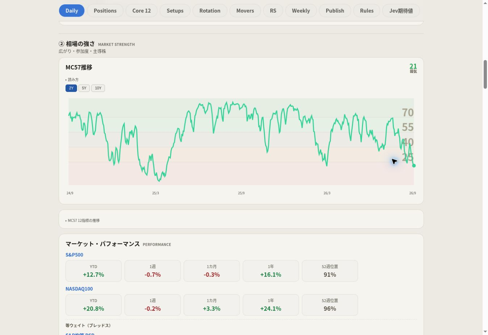
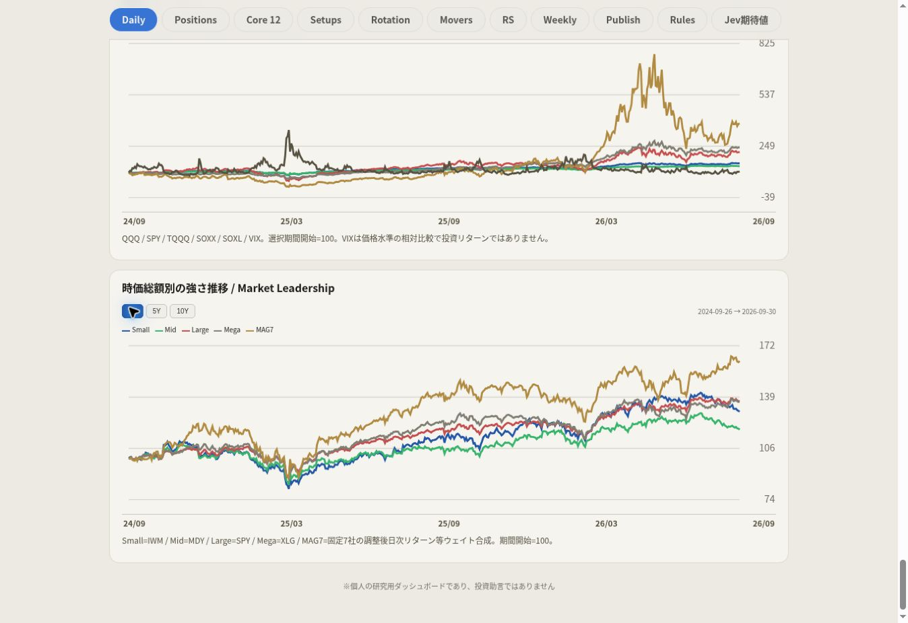

# 2026-10-01 表示修正

## MC57の背景帯

期間切替の共通描画処理が元のMC57背景帯を再現していなかった。元の色・opacity 0.07・境界25/40/55/70をすべての期間に復元。NQSAR色とは無関係なMC57スコア帯であり、計算・判定を変更しない。

## MC57構成系列

短期参加率の大きな上下と4本の重なりは数値誤りではないが、読みづらかった。凡例をタップして系列を表示・非表示にできるようにした。線の色・元の値・0〜100の軸を維持し、平滑化しない。最後の1系列は非表示にできず、空のグラフにしない。横軸と説明文の間隔を確保した。

## 横軸の欠落

元の `_spark` は日付ラベルを省いていた。ネット流動性・信用・金利・構造マクロ・マクロ圧力など、この共通関数が描く実系列に観測日軸を追加。元のSVGはそのまま保持し、同じas-of cutoffと末尾の観測数を使って開始・中央・終了の日付を表示する。週次・月次・欠測を日次と仮定して日付を捏造しない。既に日付軸があるチャートは重複させず、時間を表さないRRG散布図には日付軸を追加しない。

変更ファイル: `assets/market-history.js`、`assets/market-history.css`、`scripts/market_internals_ui.py`、`tests/test_market_history.py`、`tests/market_history_ui.cjs`。

ローカル数値テスト58件成功。公開前のブラウザゲートには各期間の背景帯、系列タップ、横軸と説明の間隔、全小型グラフの日付軸検査を追加。

## 取得失敗時の扱い

Yahooの長期価格取得は空応答・最新日不足を最大3回再試行する。調整後価格の基準が変わった場合は全期間を取り直し、失敗時には旧基準と新基準を継ぎ合わせない。旧キャッシュは元の観測日を維持し、最新日に見せかけない。最新データが足りないチャート・期間は選択肢ごと非表示にする。公開前検査も、データが実際に利用可能なカードを検証し、利用不可のカードが隠されていることを検証する。

実データ取得に成功したキャッシュは、後続の表示検査の成否にかかわらず取得直後に保存する。元のキャッシュキー・保存ファイル・Massive制限処理・非公開保存経路を維持する。

追加変更ファイル: `scripts/market_history.py`、`scripts/validate_publication.py`、`.github/workflows/refresh-source-mc57.yml`。

## 08:06 JSTの表示修正

共通CSSの `height:180px` が元のSVGの縦横比を無視して、iPhoneでMC57を縦に引き伸ばしていた。固定高さを外し、既存のBreadth等と同じ `height:auto` で元の680×180の縦横比を維持する。期間切替の描画でも元のMC57線色 `#34d399` を使う。

Breadthの長い履歴制約は、元の「読み方」の中へ移す。利用できない期間のボタンは引き続き表示しない。

Daily末尾に並べていたMC57構成指標4枚は、MC57カードの次に置いた閉じた「MC57 12指標の推移」へまとめる。内訳の値・12指標・計算は維持する。代わりにDailyにもSmall / Mid / Large / Mega / MAG7の実データによる時価総額別推移を追加する。Rotationにも同じ比較を維持し、JSONは同じブラウザキャッシュを共有する。

## 検証・公開結果

- Python: 58件成功。2件の既存/非破壊のpandas FutureWarning。
- Chromium: 1348 / 390 / 375pxのすべてで成功。全11タブ、初期2Y、各実データ期間の切替、元の縦横比、背景帯と緑の線、系列の表示切替、閉じた内訳、Dailyの時価総額別推移、注意書きの収納、小型グラフの日付軸を確認。
- Refresh source-mc57: [36789778671](https://github.com/karu77018-lgtm/market-dashboard/actions/runs/36789778671) 成功。公開ゲート・セキュリティ検査・非公開保存・公開Artifactも成功。
- Pages: [36792057320](https://github.com/karu77018-lgtm/market-dashboard/actions/runs/36792057320) 成功。
- 実装SHA: `2a29016f97a798d5a8dc81c774d30da29d2707ee`。公開生成物SHA: `22b686b7b3813cc699fed9e67d17d1f8c1f8269a`。
- 公開ページでSmall / Mid / Large / Mega / MAG7の5本を確認。MC57の表示比率は259.9375 / 982 = 0.264702（元の180 / 680 = 0.264706）。18本の小型時系列すべてに日付軸があり、欠落0。
- 9/30 MC57: 表示改修前後とも **21.425684051401575**。画面の丸め表示は21。
- 既存の配色・カード・タブ・フォント・売買ルールを維持。変更は表示と安全な取得再試行/キャッシュ保存。

公開URL: https://karu77018-lgtm.github.io/market-dashboard/source-mc57.html

新規記録ファイル: 本書、`display-mc57-2026-10-01.jpg`、`display-leadership-2026-10-01.jpg`。

全体実装のデータ経路・合成式・制約は [前回の実装記録](market-internals-2026-09-30.md) を参照。Breadthの過去構成が再現できない制約と、全GICS11の10年履歴不足は継続する。利用不可の期間は表示しない。

