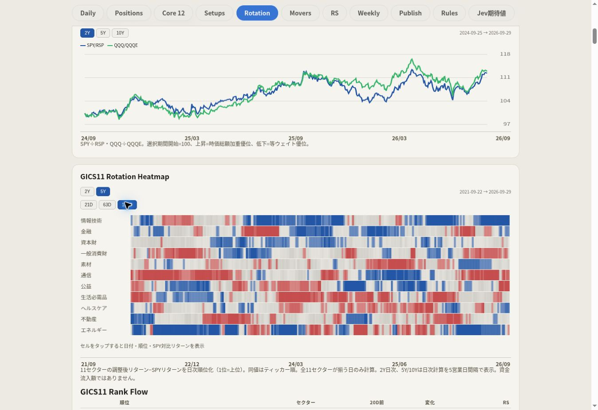

# source-mc57 市場内部分析・長期履歴 実装報告

対象公開ページ: https://karu77018-lgtm.github.io/market-dashboard/source-mc57.html

## 変更した既存ファイル

- `scripts/refresh_mc57.py`
- `scripts/build_exact_source_mc57_clone.py`
- `scripts/enhance_source_mc57.py`
- `scripts/validate_publication.py`
- `.github/workflows/refresh-source-mc57.yml`
- 日次生成物: `source-mc57.html`、`data/mc57.json`、`chart-data/`、公開用 manifest

## 新規ファイル

- `scripts/market_history.py`: 少数ETF・指数・MAG7の長期取得、計算、JSON出力
- `scripts/market_internals_ui.py`: 既存生成経路の表示整合性修正、追加カード
- `assets/market-history.js`、`assets/market-history.css`: 必要時読込、期間切替、チャート
- `market-history/index.json`、各系列の `*-2y.json` / `*-5y.json` / `*-10y.json`、`mc57-full.json`
- `tests/test_market_history.py`、`tests/fixtures/mc57_reference.py`、`tests/market_history_ui.cjs`
- `seed/mc57_display_2026-09-29.json.gz`: 改修前に公開された同一営業日の実データ保存
- この報告書
- `docs/market-internals-proof-2026-09-30.jpg`: 実公開ページの確認画像

## MC57表示・数値

旧「広がり／トレンド／ボラ／信用」の4本柱をMC57内訳から除き、実コードの12指標をMA参加率4、リターン参加率4、トレンド構造3、ドローダウン耐性1へ重複なく分類した。グループは0〜100の指標平均であり、最終MC57へ足し合わせる表示ではない。

最終値は従来どおり12指標平均→EMA2→過去の長期μ・σ→z-score→logistic。計算式は変更していない。補助ランプは「MC57外」と明示。構成指標のチャート軸は0〜100に固定した。

2026-09-29の改修前公開値 `22.356654002142744` を同じ営業日の表示基準として保持。Yahoo側の同日価格改訂により再取得値が微小に変わる場合にも、前日値でなく、当該営業日の実公開値・12指標・2年履歴を保持する。別営業日にはこの保持を適用しない。長期JSONの全期間末尾と `data/mc57.json` の値・日付を照合する。

## NQSAR責務分離

上段を「NQ運用判定／NQレジーム」と明示。NQSARの判定ロジックは不変。下段の「今日のマーケット」、市場内部説明、Publish側の市場結論はNQSAR色を入力としない。BlueでもMC57・Breadthが弱ければ「市場内部は弱い」とする。市場説明はMC57水準と傾き、50MA参加率、52週High-Low、Cap/Equal比較、サイズ別主導層、GICS順位を用いる説明専用で、売買ゲートを追加しない。

## 2Y / 5Y / 10Yのデータ経路

日次取得→`market_history.py` と従来MC57計算→外部 `market-history/` JSON→生成元からHTMLへカード・データ経路だけ追加→ブラウザが必要な期間をfetch。

504 / 1260 / 2520営業日を基準とし、全期間は同一最新営業日を要求。初期表示は2Y、5Y/10Yのデータは押した時だけ取得。メモリ・HTTPキャッシュを使用し、JS/CSSは内容ハッシュ付きURLで更新する。長期価格は約35系列だけを別キャッシュで保持し、通常は直近重複期間を増分取得。価格調整の改訂を検知した場合は当該系列を再取得する。欠損を0、無断前日流用、代替銘柄、補間で埋めない。

実データが不足する期間ボタンは無効表示ではなくHTMLから除外。新規カードは有効な2Yがなければ表示しない。既存の短期チャートは既存表示を保持し、不確かな長期切替を追加しない。

## Leadership / MAG7

Small=IWM、Mid=MDY、Large=SPY、Mega=XLG。5系列を選択期間の開始値100に正規化。「主導層」は63営業日リターン上位2系列という透明な相対順位で、指数寄与率ではない。21D/63Dの実リターンを併記する。

MAG7はAAPL/MSFT/NVDA/AMZN/META/GOOGL/TSLAの固定7銘柄。Yahooの明示的Adjusted Closeによる日次リターンを1/7ずつ平均して複利連鎖し、日次等ウェイト・リバランスとする。7銘柄がそろわない日を補間しない。これは現在の7銘柄を遡及した比較用バスケットであり、過去時点の投資可能な構成銘柄選定や指数寄与率を再現したものではない。

SPY/RSP、QQQ/QQQEの開始100比較と価格比の相対強度を追加。「細い相場」とIndex/Internals Divergenceは指数リターン、Cap/Equal差、50MA参加率、High-Lowの実値から説明を生成する。新規ハードゲート・複雑な売買スコアは設けない。

## GICS11

実コードのRSPT/RSPF/RSPN/RSPD/RSPM/RSPC/RSPU/RSPS/RSPH/RSPR/RSPGを利用。各日の21/63/126営業日Adjusted CloseリターンからSPYの同期間リターンを引き、11セクター内で降順に順位付け。同値はティッカー順に固定し、1〜11が重複しない。Rank Flowは現在と正確な20営業日前を比較し、Heatmapと同じデータでTop3/Bottom3を示す。

計算は日次。2Yは日次表示、5Y/10Y用の出力は週次相当サンプリングで最新日も保持。現在はRSPC等の実履歴不足により全11セクターの10Yを成立させられないため、10Yボタンを表示しない。2Y/5Yと21D/63D/126Dのみを実際に利用可能な選択肢として提供する。

## Breadth

過去時点ユニバースを再現できる構成銘柄データがないため、個別株Breadthは従来2Yの現ユニバース参考値に限定。5Y/10Yボタンを表示しない。固定57ETFのMC57構成系列と個別株Breadthは明確に別系列として説明する。

## テスト・公開確認

最終コードコミット: `b8ddb10d43615aa265edde34450c15f901fd28d5`。日次生成・公開コミット: `9cea06be3022afb2ab33eef58c70489d23abe860`。

- 自動テスト55件成功（既存pandas由来の警告1件）。MC57改修前との数値一致、全期間末尾一致、12指標の分類・raw再構築、Blue/Red変更に影響されない本文、MAG7欠損・複利、GICS順位・20営業日前・欠損処理、利用不可ボタンの除外を検査。
- 実生成データを使うChromiumブラウザテストは1348px / 390px / 375pxで成功。既存11タブ、初期2Y、初期5Y/10Y fetchなし、MC57・Leadership・Cap/Equal・相対強度の全3期間、GICSの利用可能6組、Top3/Bottom3、開始値100、横はみ出し、VIX見切れ、縦軸重複、構成指標0〜100を確認。
- Refresh source-mc57 Actions [36736330770](https://github.com/karu77018-lgtm/market-dashboard/actions/runs/36736330770) は成功。取得、生成、ブラウザ検証、公開ゲート、秘密情報検査、既存Drive保存、長期キャッシュ保存、公開コミットまで完了。
- GitHub Pages [36737720258](https://github.com/karu77018-lgtm/market-dashboard/actions/runs/36737720258) は成功。
- 公開ページを再読込し、NQ Blueと「市場内部は弱い」が独立して表示されること、Breadthに長期ボタンがないこと、GICSは2Y/5Yだけで5Y・126Dの実Heatmapと11位までのRank Flowが表示されること、Leadership10Y、VIX10Yの下端、VIX期間構造10Yの小数目盛、MC57構成10Yの0/33/67/100目盛を直接確認。
- 公開 `data/mc57.json` とMC57の2Y/5Y/10Y JSON末尾はいずれも2026-09-29、`22.356654002142744`。
- 公開HTMLは10,422,846 bytes。改修前10,438,408 bytesより小さく、10年データをHTMLに全量埋め込んでいない。

確認画像:

## デザインと既知の制約

元ページの既存CSS・既存スクリプト・カード・タブ・配色・フォント・角丸を保持し、追加部分はスコープ付きCSSで同じ青／赤／緑／グレー／ベージュを使う。VIXの見切れだけを局所的に修正。VIX期間構造の縦軸は実レンジに応じた小数精度を使い、ラベルの重複を避ける。VIX Fear Cycleの既存LWMA・イベント判定・長期基準計算は不変。

V38売買規則、買い条件、ユニバース選定、Jev計算、ランキング、無関係なMassive/FRED計算は変更していない。過去資料・ログは削除していない。

制約: GICS11の10Yと個別株Breadthの長期化は未提供。MAG7は固定構成の遡及比較。日次取得元が欠損する系列は選択肢を隠し、系列を捏造しない。既存統合診断に残る無関係な入力不足の警告は今回の分析追加で解消したと主張しない。
